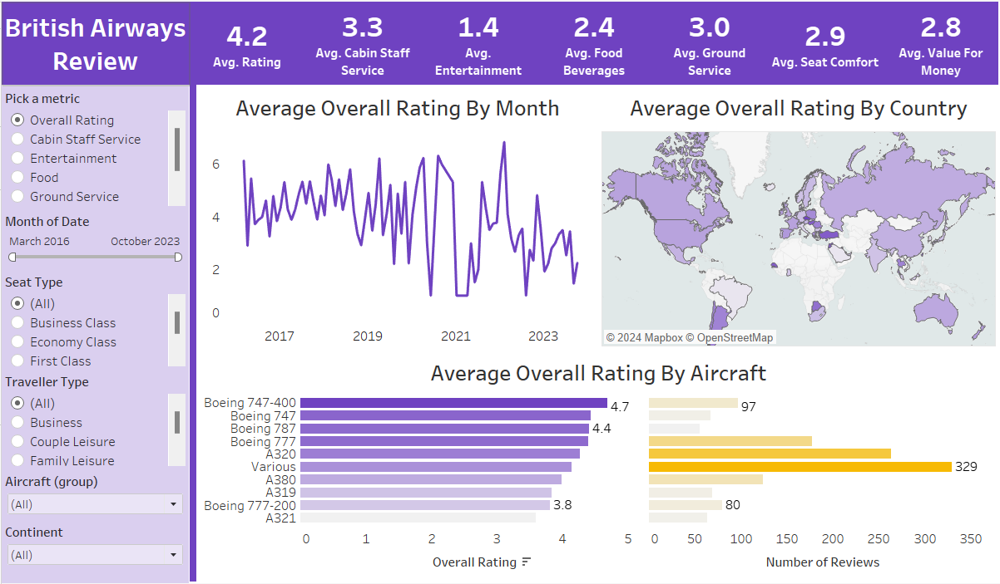
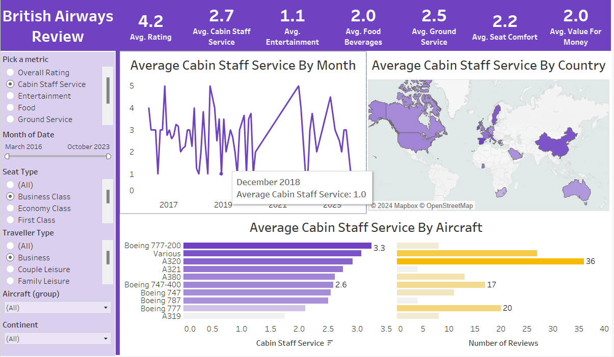
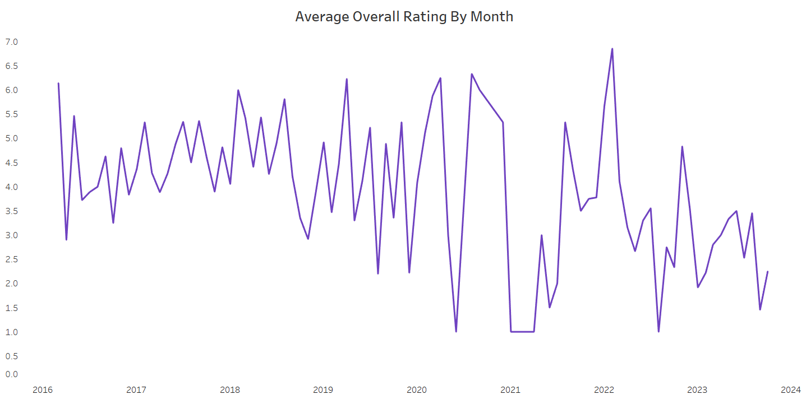
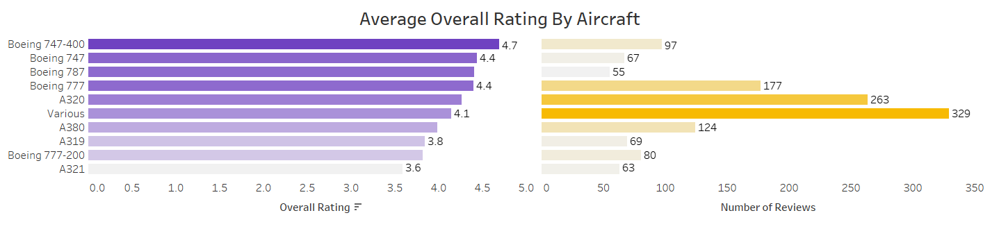
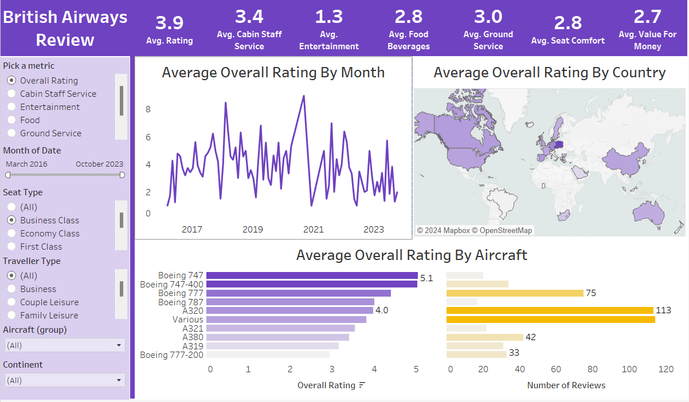
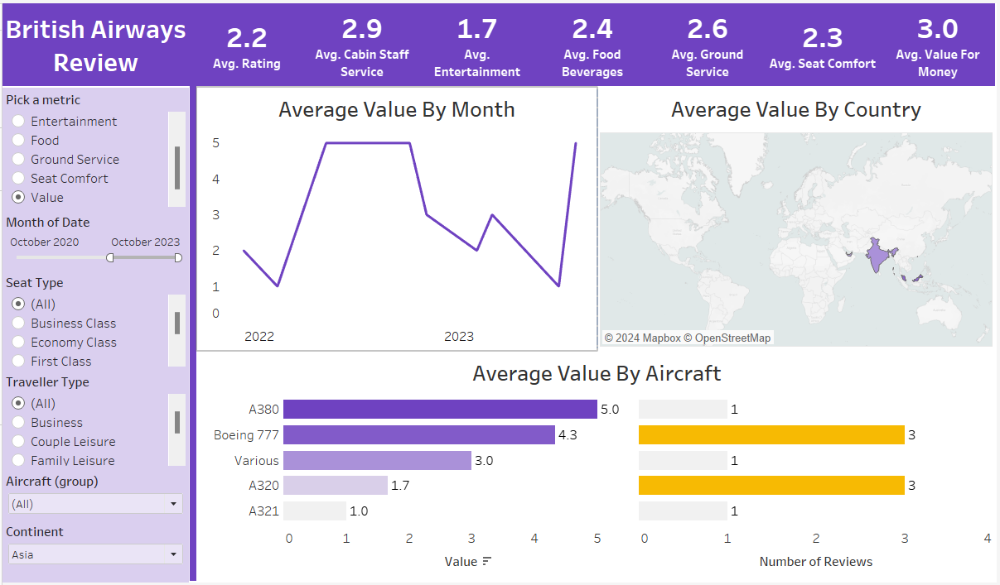
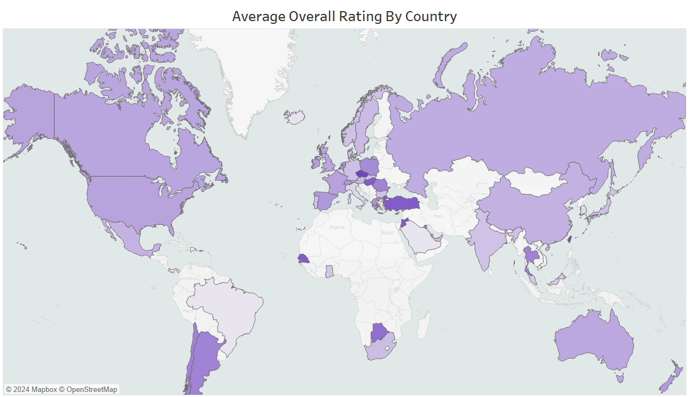

# British Airways Reviews Analysis Dashboard

## Introduction
This Tableau dashboard offers a detailed analysis of customer reviews for British Airways. The analysis focuses on several key aspects to understand customer satisfaction and identify areas for improvement.
## Objective
To address this issue, I created a dashboard on Tableau that would provide British Airways with an easy-to-understand overview of their customer reviews, facilitating efficient analysis and empowering the airline to make strategic improvements in response to customer feedback.
## Overview
This project demonstrates proficiency in data visualization using Tableau, focusing on deriving actionable insights from customer feedback data. It highlights the importance of sentiment analysis, thematic categorization, and temporal trends in understanding customer satisfaction and improving service quality.
## Project Structure & Task

1. Data Loading and Initial Exploration

2. Data Source Connection 

3. Visualization Creation along with Dynamic title creation

4. Interactive Dashboard Design

5. Make Analysis Recommendations

## Data & Resource Used

**Dataset**

Option 1: [Kaggle](https://www.kaggle.com/datasets?fileType=csv)

Option 2: And, also the dataset can be found on [Mo Chen](https://www.youtube.com/@mo-chen) YouTube Channel. I am grateful for his guidance on this project.

**Tools** 

Microsoft Excel, and Tableau.

## Data Visualization & Key Findings
### 1. The Dashboard
**Insight:** The interactive dashboard not only offers British Airways a comprehensive overview of customer reviews but also empowers users to delve into specific areas of interest. With the ability to filter by various criteria such as type of rating (metric), date, traveler type, seat type, aircraft group, and continent, the dashboard becomes a versatile tool for in-depth analysis. This functionality allows British Airways to pinpoint areas of excellence or improvement, facilitating data-driven decision-making. The inclusion of panels displaying average selected ratings by month, country, and aircraft further enhances the dashboard’s utility, providing a nuanced understanding of customer satisfaction metrics for informed strategic enhancements in services.

### 2. Sentiment Analysis:

**Insight:** Most of the reviews are positive, indicating general customer satisfaction. Sentiment is categorized into positive, neutral, and negative, providing a clear picture of customer perceptions.

### 3. Reviews

**Insight:** Highlight service quality, flight comfort, and punctuality are in positive reviews. Commonly mentioned customer service, flight delays, and baggage handling issues are maximum in negative reviews

### 4. Seat Type Experience

**Insight:** Most reviews come from economy class, with a mix of sentiments. Fewer reviews are from first class and business, but they are predominantly positive, suggesting a higher satisfaction level in premium classes.

### 4. Temporal Trends

**Insight:** The analysis identifies patterns in review sentiments over time. Peaks and troughs may correspond to specific events or seasonal travel trends. This temporal analysis helps in understanding how customer satisfaction changes over different periods.

### 5. Geographical Distribution

**Insight:** Reviews are analyzed based on geographical locations, offering insights into regional performance and customer experiences across different routes

## Conclusion
The interactive dashboard developed for British Airways provides a comprehensive and nuanced analysis of customer reviews. By leveraging the ability to filter by rating type, date, traveler type, seat type, aircraft group, and continent, the dashboard serves as a powerful tool for pinpointing areas of both excellence and improvement. The detailed panels displaying average selected ratings by month, country, and aircraft offer valuable insights into customer satisfaction, enabling British Airways to make informed, data-driven decisions. This analytical capability is instrumental in identifying trends, addressing issues, and enhancing service quality, ultimately improving the overall customer experience.
## Recommendations
For future analysis, it is recommended to:

**Integrate Additional Data Sources:** Incorporate data from other customer touchpoints, such as social media feedback and in-flight surveys, to gain a more comprehensive view of customer sentiment.

**Sentiment Analysis:** Apply natural language processing (NLP) techniques to analyze qualitative review comments for sentiment analysis, providing deeper insights into customer perceptions beyond quantitative ratings.

**Predictive Analytics:** Implement predictive analytics to forecast customer satisfaction trends based on historical data and potential changes in service offerings or market conditions.

**Benchmarking Against Competitors:** Include comparative data with competitor airlines to benchmark British Airways' performance and identify industry best practices.

**Real-Time Data Integration:** Develop real-time data integration capabilities to provide up-to-date insights, allowing for more agile responses to emerging trends and issues.
## Reflection
This project highlighted the critical role of data visualization in transforming raw data into actionable insights. The use of an interactive dashboard allowed for a flexible and detailed analysis, making it easier for stakeholders to explore specific areas of interest and understand complex datasets. The experience underscored the importance of clean, well-structured data and the value of user-friendly interfaces in enhancing decision-making processes. Moving forward, continuous enhancement of data analytics capabilities and the inclusion of advanced analytical techniques will further empower British Airways to optimize its services and enhance customer satisfaction.
